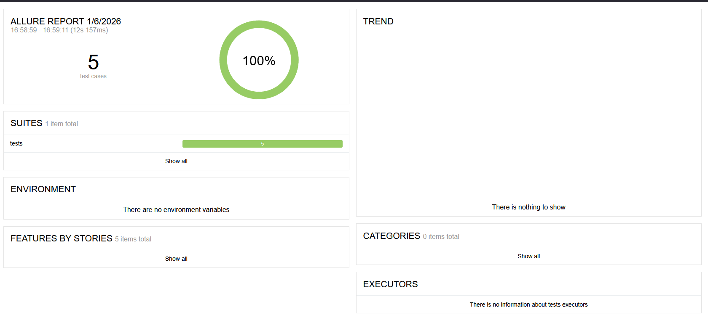
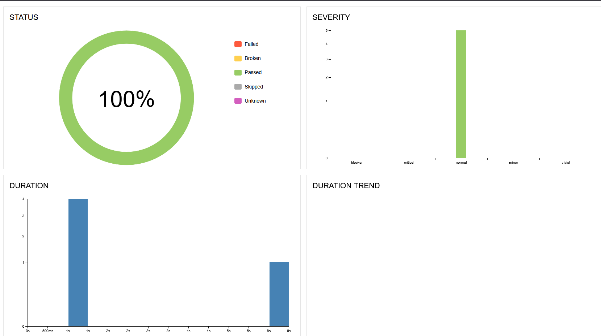

# Effective Mobile AQA ✅ **5/5 PASSED**

**Автоматизация тестирования авторизации**  

- **5 тестов авторизации** (все сценарии)
- **Page Object Model** (`pages/login_page.py`)
- **Playwright**
- **Проверка URL + элементов**
- **Allure отчетность**
- **Python 3.10**

## Локальный запуск
```bash
pip install -r requirements.txt
playwright install chromium
pytest tests/ --alluredir=allure-results -v -s
allure serve allure-results/ # localhost:8080


## Docker + Allure
docker build -t saucedemo-aqa .

```bash
docker run --rm -v $(pwd)/allure-results:/app/allure-results saucedemo-aqa
```PowerShell
docker run --rm -v ${PWD}/allure-results:/app/allure-results saucedemo-aqa

allure serve allure-results/


